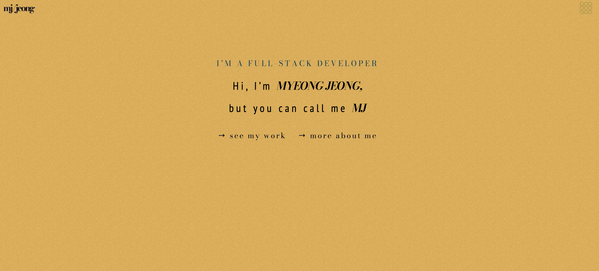

# "MJ-Portfolio-v01"

## Description



A portfolio designed using Figma, powered by React and styled-components. Front-end only appliceation, and all animations are made using CSS and framer-motion. 

---

## Table of Contents

- [Installation](#installation)
- [Usage](#usage)
- [Credits](#credits)
- [Collaboration](#collaboration)
- [Questions](#questions)

---

## Installation

You can simply download/clone the app from its repo to install.

To clone, run the following command in your terminal:

```
   git clone https://github.com/mjtic/mj-portfolio-v01.git
```

To download: Simply click on the download button on the repository on browser and extract.

Or you can just click on the link below to see the deployed app.

https://mjtic.github.io/mj-portfolio-v01/

---

## Usage

You can simply run the app by opening the github pages link below.

https://mjtic.github.io/mj-portfolio-v01/

---

## Credits

Thank you, Sharlee, for invaluable UI/UX ideas, your work never stops to amaze me. More importantly, I want to express my gratitude to my friend, Youngjoon, for consistently inspiring and motivating me. 

---

## Collaboration

Please email me for collaborating ideas.

---

## Questions

Please email me or find me on Github for any questions or issues.

Find me on Github: [mjtic](https://github.com/mjtic)

You can also contact me at lifescriptified@gmail.com

---
